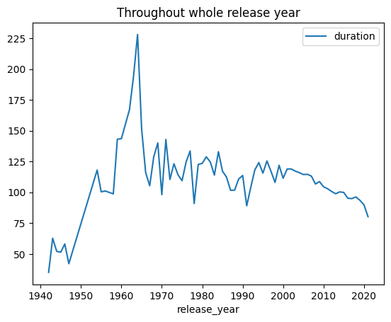
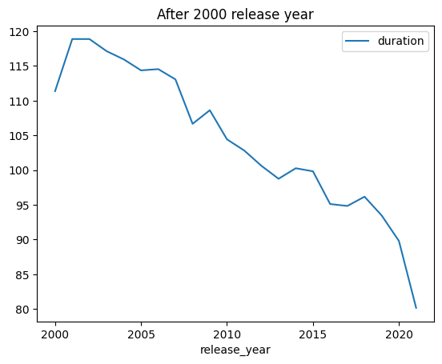
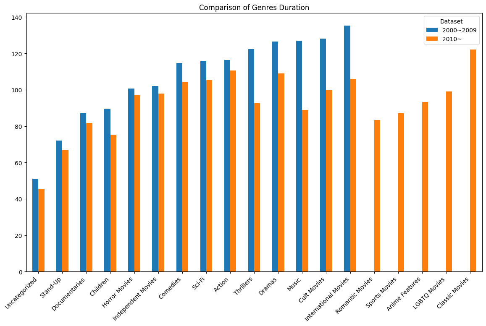

<!-- _class: center -->

# Mini-Project2
**Investigating Netflix Movies**

June 21th
Yoji

--- 

# Agenda

1. Overreview
2. Analyzing
   1. Part 1
   2. Part 2
3. Future Outlook
4. Conclusion

---

# Overreview

## Objective

Investigating duration trend of movies accroding to netflix data.

## Tools

I could use pandas and matplotlib with Jupyter notebook.

---

# Analyzing - Simplify Data

For this project, I am going to analyze about duration so I don't need following data.
`title, director, cast, country, date_added, description`

- I deleted these data from dataset.
- I wanted to foucs on moive, but dataset include TV shows. I deleted TV show data.
- Some data could've had defect(NaN), I deleted these data

```python
import pandas as pd

dataset = pd.read_csv('netflix_data.csv')
dataset = dataset.set_index('show_id')
dataset = dataset[dataset['type'] == 'Movie']
dataset.drop(['type', 'title', 'director', 'cast', 'country', 'date_added', 'description'], axis=1)
dataset.dropna()

dataset.describe()
```

---

# Analyzing - Part 1

- What was the most frequent movie duration in the 1990s? 
**Answer: 94**
```python
tmp_dataset = dataset.query('1990 <= release_year <= 1999')
frequent_duration = tmp_dataset['duration'].value_counts()
```
<br>

- A movie is considered short if it is less than 90 minutes. Count the number of short action movies released in the 1990s and save this integer as short_movie_count.
**Answe: 42**
```python
short_movie_count = len(tmp_dataset[tmp_dataset['duration'] <= 90])
```

---

# Analyzing - Part 2

- What does this trend look like over a longer period of time?
**Answer: It tend to decrease**

 

---

- Is this explainable by something like the genre of entertainment?
**Answer: Yes, every genre movie tend to decrese duration.**



---

# Future Outlook
~If you have to do adavance research~

## My expectation

I found moive tend to decrease duration. But these day, moive has series. For exsample Terminator, Mission impossible, and Avatar.
even though each moive has short duration, if analyze throughout whole series movie has longer duration than past.

## Way to research

Current data doesn't have data which indicate this moive belong to what series. If I get additional data, I can make sure my expectation.

---

# Conclusion

## Impression

Before this project, I thought movie duration was decreasing because yonger people tend to like shorter content like TikTok and Reels. After this project, I'm sure my thinking is true.

## Challenges

It was my first time to use "Pandas". It has original object format so that it is hard to get used to. But I quickly realized it is usefull library to anlayze data. If you want to edit and analyze data Mathematically, "Numpy" could be best library. But if you want to filter and group like SQL, "Pandas" could be best libray.